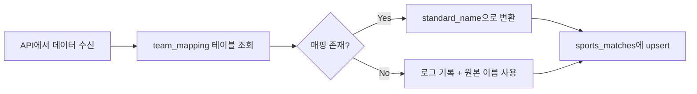

# 국내 리그 통합 동기화 API 가이드

## 📋 개요

**경로:** `/api/sync-domestic`

한국의 주요 스포츠 리그(K-리그, KOVO, KBL/WKBL) 데이터를 여러 API에서 가져와 통합하고, 팀 이름을 표준화하여 `sports_matches` 테이블에 저장합니다.

---

## 🔧 주요 기능

### 1. **멀티 API 연동**

| 리그 | API | 설명 |
|------|-----|------|
| **K-리그** | [The Odds API](https://the-odds-api.com/) | 한국 프로축구 K리그1 |
| **KOVO** | [API-Volleyball](https://www.api-volleyball.com/) | 한국 프로배구 |
| **KBL/WKBL** | [API-Basketball](https://www.api-basketball.com/) | 한국 프로농구 (남자/여자) |

### 2. **팀 이름 변환 로직 (핵심)**



**예시:**
```
API 원본: "FC Seoul"
      ↓
team_mapping 조회
      ↓
표준 이름: "서울 FC"
```

### 3. **결과 우선순위**

- **점수 데이터가 있는 경우에만** `is_finished = true`로 설정
- 배당만 있고 점수가 없으면 경기 진행 중으로 간주

### 4. **예외 처리**

- 매핑되지 않은 팀이 나와도 에러 대신 **경고 로그** 남김
- 관리자가 나중에 `team_mapping` 테이블에 수동 추가 가능

---

## 🗄️ 데이터베이스 스키마

### `team_mapping` 테이블

```sql
CREATE TABLE team_mapping (
  id SERIAL PRIMARY KEY,
  league VARCHAR(50) NOT NULL,        -- 'K-LEAGUE', 'KOVO', 'KBL', 'WKBL'
  api_source VARCHAR(100) NOT NULL,   -- API 출처
  api_name TEXT NOT NULL,             -- API 원본 팀 이름
  standard_name TEXT NOT NULL,        -- 표준화된 팀 이름
  is_active BOOLEAN DEFAULT TRUE,
  created_at TIMESTAMP WITH TIME ZONE DEFAULT NOW(),
  updated_at TIMESTAMP WITH TIME ZONE DEFAULT NOW(),
  
  UNIQUE(league, api_source, api_name)
);
```

### 샘플 데이터

```sql
-- K-리그 예시
INSERT INTO team_mapping (league, api_source, api_name, standard_name) VALUES
  ('K-LEAGUE', 'The Odds API', 'FC Seoul', '서울 FC'),
  ('K-LEAGUE', 'The Odds API', 'Ulsan Hyundai', '울산 현대'),
  ('K-LEAGUE', 'The Odds API', 'Jeonbuk Hyundai Motors', '전북 현대');

-- KOVO 예시
INSERT INTO team_mapping (league, api_source, api_name, standard_name) VALUES
  ('KOVO', 'API-Volleyball', 'Incheon Korean Air Jumbos', '인천 대한항공'),
  ('KOVO', 'API-Volleyball', 'Seoul Woori Card Wibee', '서울 우리카드');

-- KBL 예시
INSERT INTO team_mapping (league, api_source, api_name, standard_name) VALUES
  ('KBL', 'API-Basketball', 'Seoul SK Knights', '서울 SK'),
  ('KBL', 'API-Basketball', 'Ulsan Hyundai Mobis Phoebus', '울산 모비스');
```

---

## ⚙️ 환경 설정

### `.env.local` 파일

```bash
# Supabase
NEXT_PUBLIC_SUPABASE_URL=https://your-project.supabase.co
SUPABASE_SERVICE_ROLE_KEY=your-service-role-key

# The Odds API (K-리그)
ODDS_API_KEY=your-odds-api-key

# API-Volleyball (KOVO)
VOLLEYBALL_API_KEY=your-volleyball-api-key

# API-Basketball (KBL/WKBL)
BASKETBALL_API_KEY=your-basketball-api-key
```

### API 키 발급 방법

1. **The Odds API**: https://the-odds-api.com/
   - 무료 플랜: 월 500 요청
   - 스포츠: `soccer_korea_kleague_1`

2. **API-Volleyball**: https://www.api-volleyball.com/
   - 가입 후 대시보드에서 키 발급

3. **API-Basketball**: https://www.api-basketball.com/
   - 무료 플랜: 일 100 요청
   - 리그: `kbl`, `wkbl`

---

## 🚀 사용 방법

### 1. 데이터베이스 마이그레이션

```bash
# Supabase SQL Editor에서 실행
schema_team_mapping.sql
```

### 2. 수동 동기화 (개발 중)

```bash
# PowerShell
Invoke-WebRequest -Uri "http://localhost:3000/api/sync-domestic" -Method GET

# curl
curl http://localhost:3000/api/sync-domestic
```

### 3. 자동 동기화 (Vercel Cron)

**vercel.json** 수정:

```json
{
  "crons": [
    {
      "path": "/api/sync-domestic",
      "schedule": "0 */6 * * *"
    }
  ]
}
```

**스케줄 예시:**
- `0 */6 * * *` - 6시간마다 (0시, 6시, 12시, 18시)
- `0 0,12 * * *` - 하루 2번 (자정, 정오)
- `0 8 * * *` - 매일 오전 8시

### 4. 응답 예시

```json
{
  "success": true,
  "message": "국내 리그 동기화 완료",
  "stats": {
    "total": 45,
    "kleague": 12,
    "kovo": 18,
    "kbl": 15,
    "saved": 45,
    "failed": 0
  },
  "duration": "2341ms",
  "timestamp": "2026-01-19T12:00:00.000Z"
}
```

---

## 📊 팀 매핑 관리

### 새로운 팀 추가

```sql
-- 로그에서 "⚠️ 팀 매핑 없음: [K-LEAGUE/The Odds API] "New Team""를 발견한 경우
INSERT INTO team_mapping (league, api_source, api_name, standard_name)
VALUES ('K-LEAGUE', 'The Odds API', 'New Team', '새로운 팀명');
```

### 팀 이름 수정

```sql
UPDATE team_mapping
SET standard_name = '수정된 팀명'
WHERE league = 'K-LEAGUE'
  AND api_source = 'The Odds API'
  AND api_name = 'FC Seoul';
```

### 팀 비활성화 (삭제 대신)

```sql
UPDATE team_mapping
SET is_active = false
WHERE league = 'K-LEAGUE'
  AND api_name = 'Disbanded Team';
```

### 매핑 조회

```sql
-- 특정 리그의 모든 매핑 조회
SELECT * FROM team_mapping
WHERE league = 'K-LEAGUE'
  AND is_active = true
ORDER BY standard_name;

-- 매핑되지 않은 팀 찾기 (로그 확인 후)
SELECT DISTINCT home_team, away_team
FROM sports_matches
WHERE sport_key = 'K-LEAGUE'
  AND (home_team NOT IN (SELECT standard_name FROM team_mapping WHERE league = 'K-LEAGUE')
       OR away_team NOT IN (SELECT standard_name FROM team_mapping WHERE league = 'K-LEAGUE'));
```

---

## 🔍 트러블슈팅

### 1. "팀 매핑 없음" 경고

**로그 예시:**
```
⚠️ 팀 매핑 없음: [KOVO/API-Volleyball] "New Volleyball Team"
```

**해결:**
```sql
INSERT INTO team_mapping (league, api_source, api_name, standard_name)
VALUES ('KOVO', 'API-Volleyball', 'New Volleyball Team', '새 배구팀');
```

### 2. API 키 오류

**증상:** 특정 리그 데이터가 0개

**확인:**
```bash
# .env.local 파일 확인
cat .env.local | grep API_KEY

# API 키 유효성 테스트
curl "https://api.the-odds-api.com/v4/sports?apiKey=YOUR_KEY"
```

### 3. 동기화 느림

**원인:** API 호출이 순차적으로 실행됨

**해결:** 이미 병렬 처리 구현됨 (`Promise.all`)

---

## 📈 모니터링

### Vercel Logs 확인

```bash
vercel logs --follow
```

**예상 로그:**
```
🏀 국내 리그 동기화 시작...
✅ 팀 매핑 로드 완료: 47개 항목
✅ K-리그 데이터: 12개 경기
✅ KOVO 데이터: 18개 경기
✅ KBL/WKBL 데이터: 15개 경기
✅ 경기 데이터 저장 완료: 45개
```

### Supabase Dashboard

1. **Table Editor** → `sports_matches`: 최신 경기 데이터 확인
2. **Table Editor** → `team_mapping`: 팀 매핑 상태 확인
3. **Logs** → SQL Logs: 쿼리 성능 확인

---

## 🎯 다음 단계

1. ✅ `schema_team_mapping.sql` 실행
2. ✅ `.env.local`에 API 키 추가
3. ✅ `/api/sync-domestic` 수동 테스트
4. ✅ `vercel.json`에 Cron Job 추가
5. ✅ 프로덕션 배포 후 모니터링

---

## 📞 문의

문제가 발생하면 로그를 확인하고, 매핑되지 않은 팀은 `team_mapping` 테이블에 추가해주세요!
