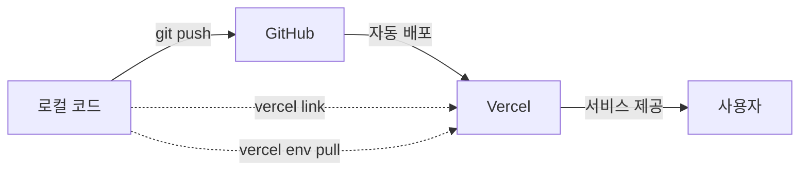

# 🔗 GitHub와 Vercel 연동 설명

## ❓ GitHub 자동 푸시인데 왜 Vercel 연결?

**결론부터:** GitHub와 Vercel은 **서로 다른 목적**입니다! 🎯

---

## 📊 비교표

| 구분 | GitHub | Vercel |
|------|--------|--------|
| **역할** | 코드 저장소 | 웹 호스팅 & 배포 |
| **목적** | 버전 관리 | 실제 서비스 운영 |
| **접근** | 개발자만 | 전 세계 사용자 |
| **URL** | github.com/user/repo | your-app.vercel.app |

---

## 🔄 전체 흐름



---

## 1️⃣ GitHub → Vercel 자동 배포

### 이미 연동되어 있다면

**GitHub에 push할 때마다 자동으로 Vercel에 배포됩니다!**

```bash
git add .
git commit -m "feat: Add sports betting"
git push origin master
```

→ **자동으로 Vercel에 배포됨** ✅

**Vercel Dashboard에서 확인:**
```
Settings → Git → Connected Git Repository
✅ github.com/your-username/exit-system
```

---

## 2️⃣ `vercel link`는 왜 필요한가?

### GitHub 연동 ≠ CLI 연동

**GitHub 연동:**
- Git push → 자동 배포 ✅
- 브라우저에서 관리 ✅

**CLI 연동 (`vercel link`):**
- 로컬에서 명령어 실행 ✅
- 환경 변수 관리 (`vercel env pull`) ✅
- 로그 확인 (`vercel logs`) ✅
- 수동 배포 (`vercel --prod`) ✅

### 실제 사용 예시

#### ❌ CLI 연결 안 함
```bash
vercel env pull
# Error: No project linked
```

#### ✅ CLI 연결 후
```bash
vercel link  # 한 번만 실행
vercel env pull  # 환경 변수 다운로드
vercel logs  # 로그 확인
```

---

## 🎯 언제 무엇을 사용하나?

### GitHub만 사용 (권장)

**일반적인 개발 흐름:**
```bash
1. 코드 수정
2. git add .
3. git commit -m "message"
4. git push origin master
5. Vercel에서 자동 배포 ✅
```

**장점:**
- 간단함
- 자동화
- 배포 히스토리 관리

### Vercel CLI 사용

**특수한 경우에만:**
```bash
# 환경 변수 관리
vercel env add ODDS_API_KEY

# 긴급 배포 (Git 우회)
vercel --prod

# 로그 실시간 확인
vercel logs --follow

# 프리뷰 배포 테스트
vercel
```

**단점:**
- 수동 작업
- Git 히스토리 없음
- 팀 협업 어려움

---

## 🔧 설정 가이드

### ✅ 추천: GitHub 자동 배포만 사용

#### 1. Vercel에서 GitHub 연동 확인

**Vercel Dashboard:**
```
1. 프로젝트 선택
2. Settings → Git
3. Connected Git Repository 확인
4. ✅ github.com/your-username/exit-system
```

#### 2. 환경 변수는 Dashboard에서 설정

**Vercel Dashboard:**
```
1. Settings → Environment Variables
2. Add 버튼으로 추가:
   - ODDS_API_KEY
   - SUPABASE_SERVICE_ROLE_KEY
   - 등등
3. Save
```

#### 3. 이제 Git Push만 하면 끝!

```bash
git push origin master
# → Vercel에서 자동 배포 시작
# → 2-3분 후 배포 완료
```

---

### 🛠️ 선택: CLI도 사용하고 싶다면

#### 1. 프로젝트 이름 수정 (중요!)

**문제:** "exit system" (공백 있음)

```bash
# 프로젝트 이름 변경
# Vercel Dashboard → Settings → General → Project Name
"exit system" → "exit-system"
```

#### 2. CLI 연결

```bash
# 로컬과 Vercel 프로젝트 연결
vercel link

# 질문에 답변:
? Link to existing project? Y
? What's your project's name? exit-system  # ← 하이픈 사용!
```

#### 3. CLI 명령어 사용 가능

```bash
# 환경 변수 다운로드
vercel env pull

# 로그 확인
vercel logs --follow

# 수동 배포 (비추천)
vercel --prod
```

---

## 📋 실전 워크플로우

### 권장 방법 (GitHub 자동 배포)

```bash
# 1. 로컬에서 개발
code .

# 2. 변경사항 커밋
git add .
git commit -m "feat: Add NBA betting support"

# 3. GitHub에 푸시
git push origin master

# 4. Vercel에서 자동 배포
# (아무것도 안 해도 됨!)

# 5. 배포 완료 확인
# Vercel Dashboard → Deployments 탭
# 또는 GitHub 커밋에 Vercel 체크마크 ✅
```

### CLI가 필요한 경우

```bash
# 긴급 핫픽스 (Git 우회)
vercel --prod

# 환경 변수 동기화
vercel env pull .env.local

# 프로덕션 로그 확인
vercel logs --prod

# 특정 브랜치 배포 테스트
git checkout feature/new-feature
vercel
```

---

## 🐛 트러블슈팅

### 문제 1: "Project names must be lowercase"

**원인:** 프로젝트 이름에 공백 또는 대문자

**해결:**
```
Vercel Dashboard → Settings → General
Project Name: "exit-system" (하이픈, 소문자만)
```

### 문제 2: "No project linked"

**원인:** CLI 연결 안 됨

**해결:**
```bash
vercel link
```

### 문제 3: Git push 후 배포 안 됨

**원인:** GitHub 연동 안 됨

**해결:**
```
Vercel Dashboard → Settings → Git
→ Connect Git Repository
→ GitHub 선택 → 저장소 선택
```

---

## ✅ 최종 정리

### 당신의 상황

```
✅ GitHub에 코드 푸시됨
✅ Vercel에서 자동 배포 설정됨
❓ vercel link가 필요한가?
```

**답변:**

| 상황 | vercel link 필요? |
|------|-------------------|
| Git push만 사용 | ❌ 불필요 |
| CLI 명령어 사용 | ✅ 필요 |
| 환경 변수 CLI로 관리 | ✅ 필요 |
| 로그 CLI로 확인 | ✅ 필요 |

**권장사항:**
- **일반 개발**: Git push만 사용 (CLI 불필요)
- **고급 관리**: CLI 연결 (`vercel link`)

---

## 🎯 결론

**GitHub 자동 배포가 이미 되고 있다면:**

```bash
# 이것만 하면 됩니다!
git push origin master

# vercel link, vercel --prod 등은 선택사항!
```

**CLI를 사용하고 싶다면:**

```bash
# 한 번만 실행
vercel link

# 이제 CLI 명령어 사용 가능
vercel env pull
vercel logs
```

---

**간단하게: Git push만 해도 자동 배포되므로, CLI는 선택사항입니다!** 🚀
