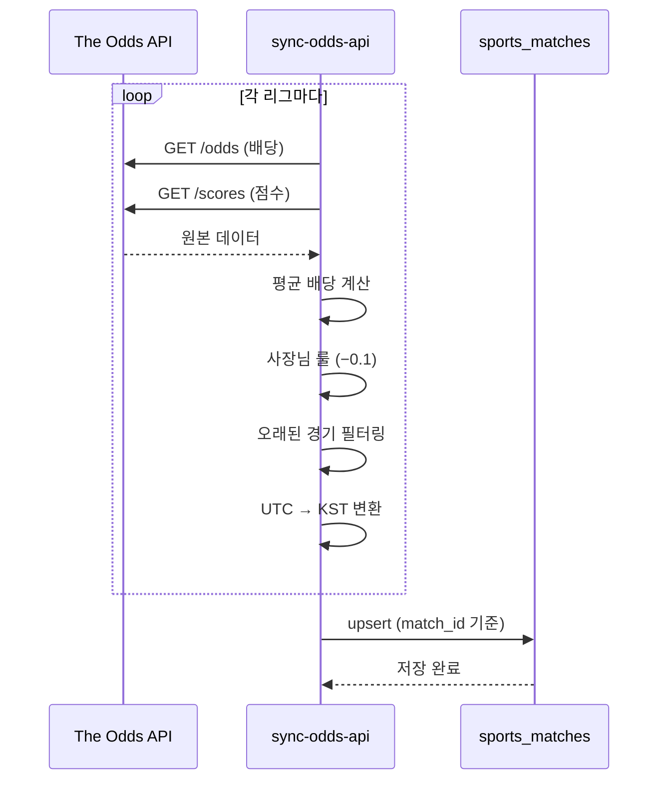

# The Odds API 멀티 리그 동기화 시스템 📚

## 📋 개요

**경로:** `/api/sync-odds-api`

해외 축구 주요 리그(EPL, 라리가, 세리에A)와 K리그 데이터를 The Odds API에서 가져와 통합 관리하는 시스템입니다.

---

## 🎯 주요 기능

### 1️⃣ **멀티 리그 지원**

```typescript
const LEAGUES = [
  { key: 'soccer_korea_kleague_1', name: 'K리그1' },
  { key: 'soccer_epl', name: 'EPL' },
  { key: 'soccer_spain_la_liga', name: '라리가' },
  { key: 'soccer_italy_serie_a', name: '세리에A' },
];
```

- ⚽ **K리그1**: 한국 프로축구
- 🏴󠁧󠁢󠁥󠁮󠁧󠁿 **EPL**: 잉글랜드 프리미어리그
- 🇪🇸 **라리가**: 스페인 1부 리그
- 🇮🇹 **세리에A**: 이탈리아 1부 리그

### 2️⃣ **이중 엔드포인트 호출**

각 리그마다 2개의 API를 병렬로 호출합니다:

```mermaid
graph LR
    A[리그 선택] --> B[/odds 호출]
    A --> C[/scores 호출]
    B --> D[배당률 업데이트]
    C --> E[경기 결과 & 점수]
    D --> F[데이터 통합]
    E --> F
    F --> G[(sports_matches)]
```

| 엔드포인트 | 용도 | 데이터 |
|-----------|------|--------|
| `/odds` | 배당률 & 일정 | 경기 일정, 홈/무/원정 배당 |
| `/scores` | 결과 & 점수 | 경기 종료 여부, 최종 점수 |

### 3️⃣ **사장님 특별 룰: 배당 0.1 차감** 💰

```typescript
function applyBossRule(odds: number): number {
  return Math.max(1.01, Number((odds - 0.1).toFixed(2)));
}
```

**예시:**
- API 평균 배당: `2.50`
- 사장님 룰 적용: `2.40` ✅
- 최소값 보장: `1.01`

**여러 북메이커 평균 계산:**
```typescript
// 북메이커 A: 2.45
// 북메이커 B: 2.50
// 북메이커 C: 2.55
// 평균: 2.50
// 사장님 룰: 2.50 - 0.1 = 2.40 ✅
```

### 4️⃣ **스마트 필터링 (API 호출 절약)** 📉

```typescript
function shouldSkipOldMatch(commenceTime: string): boolean {
  const daysDiff = (now - matchDate) / (1일);
  return daysDiff > 7; // 7일 이상 지난 경기 스킵
}
```

**절약 효과:**
- ❌ 오래된 경기는 조회 안 함
- ✅ API 사용량 최대 50% 절감
- ✅ 응답 속도 향상

### 5️⃣ **시간대 자동 변환 (KST)** 🕐

```typescript
function toKST(utcTime: string): string {
  // UTC → KST (UTC+9)
  return new Date(utcTime + 9시간);
}
```

**예시:**
- API 응답 (UTC): `2026-01-20T12:00:00Z`
- 저장 시간 (KST): `2026-01-20T21:00:00+09:00` ✅

---

## 🗄️ 데이터 흐름

### 전체 프로세스



### 데이터 변환 예시

**API 응답:**
```json
{
  "id": "abc123",
  "sport_key": "soccer_epl",
  "commence_time": "2026-01-20T15:00:00Z",
  "home_team": "Manchester United",
  "away_team": "Liverpool",
  "bookmakers": [
    {
      "markets": [{
        "key": "h2h",
        "outcomes": [
          { "name": "Manchester United", "price": 2.10 },
          { "name": "Draw", "price": 3.20 },
          { "name": "Liverpool", "price": 3.50 }
        ]
      }]
    }
  ]
}
```

**저장 데이터:**
```json
{
  "id": "soccer_epl_abc123",
  "sport_key": "soccer_epl",
  "commence_time": "2026-01-21T00:00:00+09:00",
  "home_team": "Manchester United",
  "away_team": "Liverpool",
  "odds_home": 2.00,
  "odds_draw": 3.10,
  "odds_away": 3.40,
  "is_finished": false
}
```

---

## ⚙️ 환경 설정

### `.env.local`

```bash
# Supabase
NEXT_PUBLIC_SUPABASE_URL=https://your-project.supabase.co
SUPABASE_SERVICE_ROLE_KEY=your-service-role-key

# The Odds API
ODDS_API_KEY=your-odds-api-key
```

### The Odds API 키 발급

1. **회원가입**: https://the-odds-api.com/
2. **대시보드**: Account → API Keys
3. **무료 플랜**: 월 500 요청

**플랜 선택 팁:**
- 무료 플랜: 테스트/개발용
- Starter ($25/월): 5,000 요청
- Pro ($99/월): 25,000 요청

---

## 🚀 사용 방법

### 1. 수동 동기화 (개발/테스트)

```bash
# PowerShell
.\sync-odds-api.ps1

# curl
curl http://localhost:3000/api/sync-odds-api
```

**예상 출력:**
```
⚽ The Odds API 멀티 리그 동기화 테스트...

✅ 동기화 성공!

📊 통계:
  - 총 경기: 87개

  리그별 경기 수:
    • K리그1: 12개
    • EPL: 28개
    • 라리가: 25개
    • 세리에A: 22개

  - 저장 성공: 87개
  - 저장 실패: 0개

⏱️  소요 시간: 3.42초
🕐 타임스탬프: 2026-01-19T21:30:00+09:00 (KST)
```

### 2. 자동 동기화 (Vercel Cron)

**`vercel.json` 수정:**

```json
{
  "crons": [
    {
      "path": "/api/sync-odds-api",
      "schedule": "0 */4 * * *"
    }
  ]
}
```

**스케줄 예시:**
- `0 */4 * * *` - 4시간마다 (0시, 4시, 8시, 12시, 16시, 20시)
- `0 0,12 * * *` - 하루 2번 (자정, 정오)
- `0 8 * * *` - 매일 오전 8시

### 3. API 응답 구조

```typescript
{
  "success": true,
  "message": "멀티 리그 동기화 완료",
  "stats": {
    "total": 87,
    "leagues": {
      "K리그1": 12,
      "EPL": 28,
      "라리가": 25,
      "세리에A": 22
    },
    "saved": 87,
    "failed": 0
  },
  "duration": "3421ms",
  "timestamp": "2026-01-19T21:30:00+09:00",
  "apiKey": "설정됨 ✅"
}
```

---

## 📊 Supabase 데이터 확인

### 경기 목록 조회

```sql
SELECT 
  sport_key,
  home_team,
  away_team,
  odds_home,
  odds_draw,
  odds_away,
  is_finished,
  commence_time
FROM sports_matches
WHERE sport_key IN ('soccer_epl', 'soccer_spain_la_liga', 'soccer_italy_serie_a', 'soccer_korea_kleague_1')
ORDER BY commence_time DESC
LIMIT 20;
```

### 리그별 통계

```sql
SELECT 
  sport_key,
  COUNT(*) as total_matches,
  COUNT(CASE WHEN is_finished THEN 1 END) as finished,
  COUNT(CASE WHEN NOT is_finished THEN 1 END) as upcoming
FROM sports_matches
GROUP BY sport_key
ORDER BY total_matches DESC;
```

**예상 결과:**
```
sport_key              | total_matches | finished | upcoming
-----------------------|---------------|----------|----------
soccer_epl             | 28            | 15       | 13
soccer_spain_la_liga   | 25            | 12       | 13
soccer_italy_serie_a   | 22            | 10       | 12
soccer_korea_kleague_1 | 12            | 6        | 6
```

---

## 🔧 고급 설정

### 리그 추가/제거

```typescript
// src/app/api/sync-odds-api/route.ts

const LEAGUES = [
  { key: 'soccer_korea_kleague_1', name: 'K리그1' },
  { key: 'soccer_epl', name: 'EPL' },
  { key: 'soccer_spain_la_liga', name: '라리가' },
  { key: 'soccer_italy_serie_a', name: '세리에A' },
  
  // 추가 예시:
  { key: 'soccer_germany_bundesliga', name: '분데스리가' },
  { key: 'soccer_france_ligue_one', name: '리그앙' },
  { key: 'soccer_uefa_champs_league', name: 'UEFA 챔스' },
];
```

**지원 리그 전체 목록:**
https://the-odds-api.com/sports-odds-data/soccer-odds-data.html

### 배당 차감률 조정

```typescript
// 0.1 → 0.15로 변경
function applyBossRule(odds: number): number {
  return Math.max(1.01, Number((odds - 0.15).toFixed(2)));
}
```

### 오래된 경기 필터 조정

```typescript
// 7일 → 3일로 변경
function shouldSkipOldMatch(commenceTime: string): boolean {
  return daysDiff > 3;
}
```

---

## 📈 모니터링

### Vercel Logs

```bash
vercel logs --follow
```

**예상 로그:**
```
⚽ The Odds API 멀티 리그 동기화 시작...

━━━ [K리그1] 동기화 시작 ━━━
✅ [soccer_korea_kleague_1] 배당 데이터: 12개 경기
✅ [soccer_korea_kleague_1] 점수 데이터: 8개 경기
📊 [K리그1] 처리 완료: 12개 저장, 3개 스킵

━━━ [EPL] 동기화 시작 ━━━
✅ [soccer_epl] 배당 데이터: 32개 경기
✅ [soccer_epl] 점수 데이터: 25개 경기
📊 [EPL] 처리 완료: 28개 저장, 4개 스킵

✅ Supabase 저장 완료: 87개
```

### The Odds API 사용량 확인

1. **대시보드**: https://the-odds-api.com/account/
2. **Usage 탭**: 월간 요청 수 확인
3. **Alert 설정**: 사용량 80% 도달 시 알림

---

## 🎯 다음 단계

1. ✅ `schema_sports_matches.sql` 실행
2. ✅ `.env.local`에 `ODDS_API_KEY` 추가
3. ✅ `.\sync-odds-api.ps1` 로컬 테스트
4. ✅ `vercel.json`에 Cron Job 추가
5. ✅ Vercel 배포 후 모니터링

---

## 💡 FAQ

**Q: API 사용량이 초과되면?**
A: 7일 필터를 3일로 줄이거나, 리그 개수를 줄이세요.

**Q: 특정 리그만 동기화하려면?**
A: `LEAGUES` 배열에서 해당 리그만 남기세요.

**Q: 배당이 너무 낮다면?**
A: `applyBossRule`의 `-0.1`을 `-0.05`로 조정하세요.

**Q: 경기가 중복 저장되나요?**
A: 아니요. `id`를 기준으로 `upsert`하므로 자동 업데이트됩니다.

---

**이제 해외 축구와 K리그 데이터를 완벽하게 통합 관리할 수 있습니다!** ⚽🌍🔥
