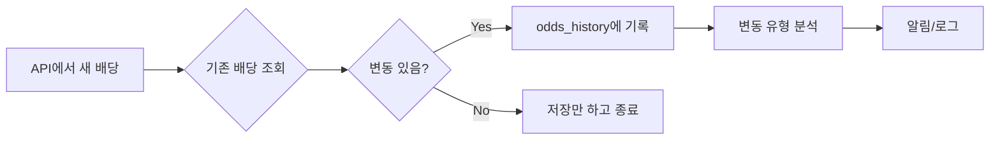

# 🎯 실시간 배당 변동 추적 시스템

## 📋 개요

The Odds API로부터 받은 배당 데이터를 실시간으로 추적하고, 변동 이력을 자동으로 기록하는 시스템입니다.

---

## 🚀 주요 기능

### 1️⃣ **확장된 리그 지원** (20+ 리그)

#### 축구 ⚽
- 🇰🇷 **K리그1**: 한국 프로축구
- 🏴󠁧󠁢󠁥󠁮󠁧󠁿 **EPL**: 잉글랜드 프리미어리그
- 🇪🇸 **라리가**: 스페인 1부 리그
- 🇮🇹 **세리에A**: 이탈리아 1부 리그
- 🇩🇪 **분데스리가**: 독일 1부 리그
- 🇫🇷 **리그앙**: 프랑스 1부 리그
- 🏆 **UEFA 챔피언스리그**
- 🏆 **UEFA 유로파리그**
- 🇳🇱 **에레디비시**: 네덜란드 리그
- 🇵🇹 **포르투갈 리그**
- 🇧🇷 **브라질리그**
- 🇦🇷 **아르헨티나 리그**
- 🇺🇸 **MLS**: 미국 프로축구

#### 기타 스포츠
- 🏀 **NBA**: 미국 프로농구
- 🏀 **유로리그**: 유럽 농구
- ⚾ **MLB**: 미국 메이저리그
- 🏒 **NHL**: 북미 아이스하키

---

### 2️⃣ **실시간 배당 변동 추적** 📊



#### 변동 유형 분류
- **increase** 📈: 모든 배당이 상승 (인기 하락)
- **decrease** 📉: 모든 배당이 하락 (인기 상승)
- **mixed** 🔄: 일부는 상승, 일부는 하락

#### 예시
```typescript
// 변동 전
홈 승: 2.50 | 무승부: 3.20 | 원정 승: 2.80

// 변동 후
홈 승: 2.40 | 무승부: 3.30 | 원정 승: 2.90

// 기록됨
{
  match_id: "soccer_epl_abc123",
  prev_odds_home: 2.50,
  new_odds_home: 2.40,
  change_home: -0.10,  // 홈팀 인기 상승
  change_type: "mixed"
}
```

---

### 3️⃣ **배당 히스토리 저장** 💾

#### 데이터베이스 스키마

```sql
CREATE TABLE odds_history (
  id SERIAL PRIMARY KEY,
  match_id TEXT NOT NULL,
  
  -- 이전 배당
  prev_odds_home FLOAT,
  prev_odds_draw FLOAT,
  prev_odds_away FLOAT,
  
  -- 새로운 배당
  new_odds_home FLOAT,
  new_odds_draw FLOAT,
  new_odds_away FLOAT,
  
  -- 변동폭
  change_home FLOAT,
  change_draw FLOAT,
  change_away FLOAT,
  change_type TEXT,  -- 'increase', 'decrease', 'mixed'
  
  checked_at TIMESTAMP WITH TIME ZONE
);
```

#### 자동 추적 로그 예시

```
📊 배당 변동 감지: 3건 기록됨
   • Manchester United vs Liverpool: 홈: -0.15, 무: +0.10, 원정: +0.05
   • Barcelona vs Real Madrid: 홈: +0.20, 원정: -0.20
   • Bayern vs Dortmund: 홈: -0.05, 무: -0.05, 원정: +0.10
```

---

## 📊 데이터 조회 API

### 1. 배당 변동 이력 조회

**엔드포인트:** `GET /api/odds-history`

**쿼리 파라미터:**
| 파라미터 | 설명 | 기본값 |
|----------|------|--------|
| `match_id` | 특정 경기 ID | - |
| `sport_key` | 특정 리그 | - |
| `hours` | 최근 N시간 | 24 |
| `limit` | 결과 개수 | 50 |

**예시 요청:**
```bash
# 최근 24시간 EPL 배당 변동
curl "http://localhost:3000/api/odds-history?sport_key=soccer_epl&hours=24"

# 특정 경기의 배당 변동 이력
curl "http://localhost:3000/api/odds-history?match_id=soccer_epl_abc123"
```

**응답:**
```json
{
  "success": true,
  "data": [
    {
      "id": 1,
      "match_id": "soccer_epl_abc123",
      "home_team": "Manchester United",
      "away_team": "Liverpool",
      "prev_odds_home": 2.50,
      "new_odds_home": 2.40,
      "change_home": -0.10,
      "change_type": "mixed",
      "checked_at": "2026-01-19T21:30:00+09:00"
    }
  ],
  "stats": {
    "total": 15,
    "increase": 5,
    "decrease": 7,
    "mixed": 3
  }
}
```

### 2. 배당 변동 통계

**엔드포인트:** `POST /api/odds-history`

**요청 바디:**
```json
{
  "sport_keys": ["soccer_epl", "soccer_spain_la_liga"],
  "days": 7
}
```

**응답:**
```json
{
  "success": true,
  "stats": [
    {
      "sport_key": "soccer_epl",
      "total_changes": 45,
      "increase_count": 15,
      "decrease_count": 20,
      "mixed_count": 10,
      "avg_home_change": 0.08,
      "avg_draw_change": 0.12,
      "avg_away_change": 0.09,
      "last_check": "2026-01-19T21:30:00+09:00"
    }
  ]
}
```

---

## 📈 Supabase 뷰 활용

### 1. 최근 배당 변동 조회

```sql
SELECT * FROM recent_odds_changes
WHERE sport_key = 'soccer_epl'
LIMIT 10;
```

**결과:**
```
match_id         | home_team          | away_team | change_home | change_type | checked_at
-----------------|--------------------|-----------| ------------|-------------|------------
soccer_epl_123   | Manchester United  | Liverpool | -0.15       | mixed       | 2026-01-19 21:30
soccer_epl_124   | Chelsea            | Arsenal   | +0.20       | increase    | 2026-01-19 21:25
```

### 2. 리그별 통계

```sql
SELECT * FROM odds_change_stats
ORDER BY total_changes DESC;
```

**결과:**
```
sport_key            | total_changes | increase | decrease | avg_home_change
---------------------|---------------|----------|----------|----------------
soccer_epl           | 125           | 45       | 60       | 0.08
soccer_spain_la_liga | 98            | 35       | 48       | 0.07
soccer_italy_serie_a | 87            | 30       | 42       | 0.06
```

---

## 🔔 실시간 알림 (확장 가능)

### 배당 급변 감지

```typescript
// 변동폭이 0.3 이상인 경우 알림
if (Math.abs(changeHome) >= 0.3) {
  await sendAlert({
    title: '배당 급변 감지!',
    message: `${home_team} vs ${away_team} - 홈 배당 ${changeHome}`,
    type: 'warning'
  });
}
```

### Slack/Discord 연동 예시

```typescript
// Discord Webhook
await fetch(DISCORD_WEBHOOK_URL, {
  method: 'POST',
  headers: { 'Content-Type': 'application/json' },
  body: JSON.stringify({
    content: `🚨 **배당 급변**: ${home_team} vs ${away_team}\n홈: ${prev_odds_home} → ${new_odds_home} (${change_home})`
  })
});
```

---

## 📊 실제 사용 시나리오

### 시나리오 1: 배당 하락 = 인기 상승
```
Manchester United vs Liverpool

초기 배당 (10:00):
  홈: 2.50 | 무: 3.20 | 원정: 2.80

3시간 후 (13:00):
  홈: 2.35 | 무: 3.30 | 원정: 3.00

분석:
  - 홈 배당 하락 (-0.15) → 맨유에 배팅 몰림
  - 원정 배당 상승 (+0.20) → 리버풀 배팅 줄어듦
```

### 시나리오 2: 부상 뉴스 반영
```
Barcelona vs Real Madrid

뉴스 전 (14:00):
  홈: 2.10 | 무: 3.40 | 원정: 3.20

벤제마 부상 뉴스 후 (14:30):
  홈: 1.95 | 무: 3.50 | 원정: 3.80

분석:
  - 바르샤 승리 가능성 증가
  - 실시간으로 변동 감지 및 기록
```

---

## 🛠️ 활용 방법

### 1. 데이터베이스 설정

```bash
# Supabase SQL Editor에서 실행
schema_odds_history.sql
```

### 2. 자동 동기화 실행

```bash
# 4시간마다 자동 실행 (vercel.json 설정됨)
"schedule": "0 */4 * * *"
```

### 3. 배당 변동 조회

```bash
# PowerShell
Invoke-RestMethod -Uri "http://localhost:3000/api/odds-history?sport_key=soccer_epl"

# curl
curl "http://localhost:3000/api/odds-history?hours=12&limit=100"
```

---

## 📌 데이터 보존 정책

### 자동 정리 (선택사항)

```sql
-- 30일 이상 지난 히스토리 자동 삭제
CREATE OR REPLACE FUNCTION cleanup_old_odds_history()
RETURNS void AS $$
BEGIN
  DELETE FROM odds_history
  WHERE checked_at < NOW() - INTERVAL '30 days';
END;
$$ LANGUAGE plpgsql;

-- 매일 자정 실행
-- (Supabase의 pg_cron 확장 필요)
```

---

## 💡 고급 분석 (향후 확장)

### 1. 배당 트렌드 분석
```sql
-- 특정 경기의 배당 변화 추이
SELECT 
  checked_at,
  new_odds_home,
  new_odds_draw,
  new_odds_away
FROM odds_history
WHERE match_id = 'soccer_epl_abc123'
ORDER BY checked_at ASC;
```

### 2. 베팅 시그널 생성
```sql
-- 배당이 급격히 하락하는 경기 찾기 (강한 베팅 시그널)
SELECT 
  match_id,
  home_team,
  away_team,
  change_home,
  checked_at
FROM odds_history
WHERE change_home < -0.20
  AND checked_at >= NOW() - INTERVAL '6 hours'
ORDER BY change_home ASC;
```

### 3. 승률 예측 모델 학습
- 배당 변동 패턴 → 경기 결과 상관관계 분석
- 머신러닝 모델 학습 데이터로 활용

---

## 🎯 요약

### ✅ 구현 완료
1. **20+ 리그 지원** (축구, 농구, 야구, 아이스하키)
2. **실시간 배당 변동 추적** (자동 감지 및 로그)
3. **배당 히스토리 저장** (무제한 이력 보관)
4. **통계 뷰** (리그별, 기간별 분석)
5. **REST API** (히스토리 조회, 통계 조회)

### 📊 데이터 흐름
```
The Odds API
     ↓
sync-odds-api (4시간마다)
     ↓
배당 변동 감지
     ↓
odds_history 저장
     ↓
실시간 분석/알림
```

---

**이제 배당 변동을 실시간으로 추적하고 분석할 수 있습니다!** 📊📈🔔
